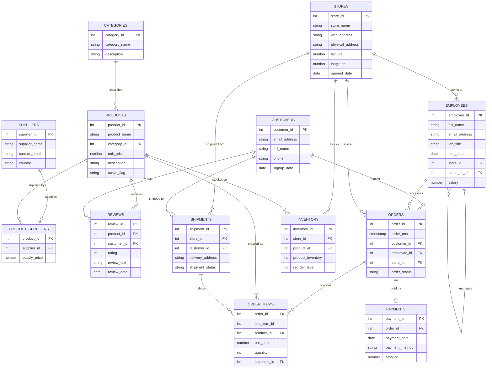

# SHOPCO - Oracle Practice Schema

SHOPCO is a sample Oracle schema for practicing SQL: joins, aggregations, window functions, hierarchical queries (`CONNECT BY`), and view design. It models a small retail business with stores, products, customers, orders, and staff, using plain relational SQL (no JSON, no PL/SQL blocks required to install).

It follows the same install/create/populate/uninstall pattern used by Oracle's own sample schemas (`HR`, `OE`, `customer_orders`, etc.), so it should feel familiar if you've used those before.

## About SHOPCO

SHOPCO is a fictional mid-sized retailer that sells general merchandise — electronics, home & kitchen goods, sporting goods, books, office supplies, toys, clothing, and beauty products — through a small chain of physical stores plus a single online store. The company runs a lean structure: a CEO at the top, a manager at each store, and a handful of sales associates reporting to them.

Customers can buy from any store or online. Each purchase becomes an order made up of one or more line items, which get shipped from the store that fulfilled them and paid for through one of several payment methods. SHOPCO tracks stock levels per store so it knows when a product needs restocking, works with a set of outside suppliers for its inventory, and collects ratings and written reviews from customers on the products they've bought.

The schema captures that whole flow end to end — from the product catalog and who supplies it, through the sales floor and online storefront, to fulfillment, payment, and customer feedback — which makes it a reasonably realistic playground for practicing everything from a simple `SELECT` to multi-table joins, sales aggregations by store or category, an employee reporting hierarchy, and rating analysis.

## Entity-relationship diagram



## Files

| File | Purpose |
|---|---|
| `shopco_install.sql` | Main entry point. Creates the `SHOPCO` user, grants privileges, and calls the two scripts below. |
| `shopco_create.sql` | Creates the 13 tables, views, indexes, constraints, and comments. |
| `shopco_populate.sql` | Loads the sample data. |
| `shopco_uninstall.sql` | Drops the schema (`DROP USER shopco CASCADE`). |
| `shopco_example_queries.sql` | ~25 example queries, from basic to advanced. |

## Requirements

- Oracle Database 19c or later.
- A user with privileges to create/drop another user (e.g. `SYSTEM`, or `SYS AS SYSDBA`).

## Installation

Run `shopco_install.sql` while connected as a privileged user. It calls `shopco_create.sql` and `shopco_populate.sql` automatically, so all five `.sql` files should be in the same directory. You'll be prompted for a password and a tablespace for the new `SHOPCO` user; once installation finishes, your session is reconnected as `SHOPCO`, ready to query.

A successful install leaves you with these row counts:

```
categories           8
suppliers             6
customers            40
stores                 5
employees             18
products              30
reviews               97
product_suppliers    40
orders               200
order_items          517
shipments            180
inventory            150
payments             180
```

## Schema overview

- **categories** — product categories
- **suppliers** — companies that supply products
- **customers** — people placing orders
- **stores** — physical and online store locations
- **employees** — staff, including a manager hierarchy (`manager_id`, self-referencing)
- **products** — items available for purchase
- **reviews** — customer ratings and comments on products
- **product_suppliers** — many-to-many link between products and suppliers
- **orders** / **order_items** — orders and their line items
- **shipments** — delivery details for orders
- **inventory** — stock levels per store/product, with reorder thresholds
- **payments** — payment recorded for each order

Included views: `customer_order_summary`, `store_sales_summary` (using `GROUPING SETS`), `product_ratings` (average rating per product), `employee_hierarchy` (using `CONNECT BY`).

## Uninstalling

Run `shopco_uninstall.sql` as a privileged user to remove the schema entirely.
